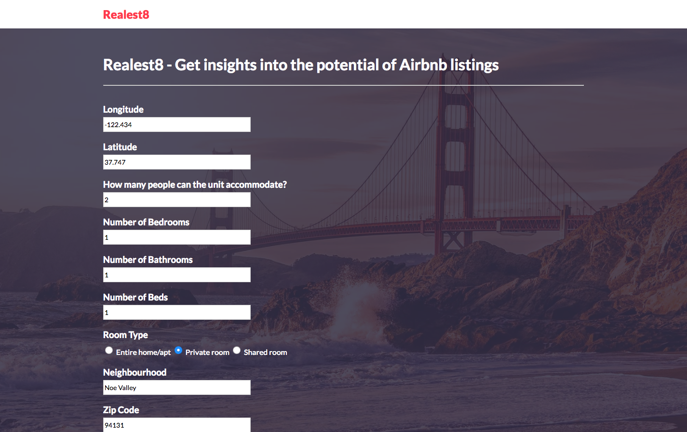
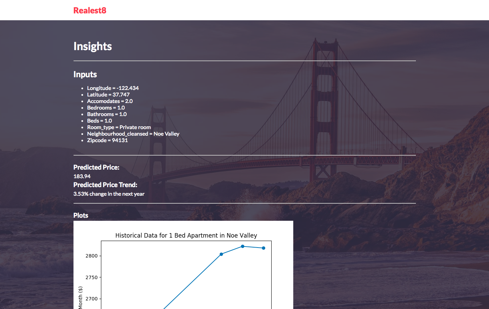
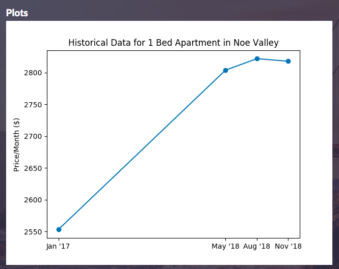
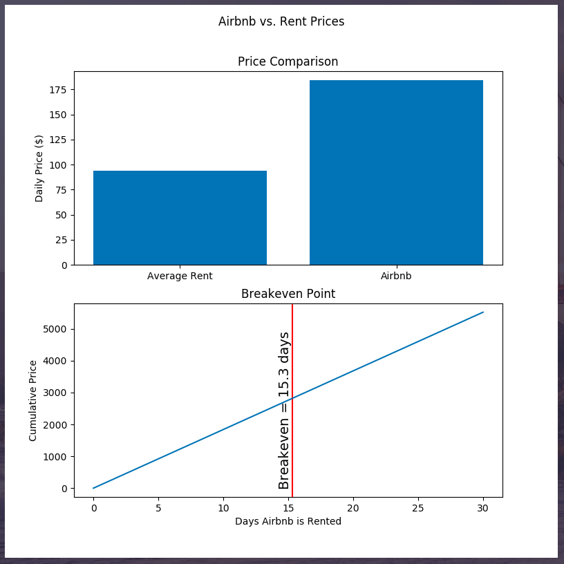

# Data-X Project - **Realest8**

## Overview
Realest8 predicts pricing and price trends of properties in the San Francisco area to inform real estate investors' decision-making.

Includes a **web-app** and **iPython Notebook** that both have the following functionality:
* Predict Airbnb listing price based on general features
* Predict Airbnb listing price change in a year from now
* Visualize/inform the user of how many days the property would have to be rented out on Airbnb to match the average monthly price of regular rent in the area

## Interactive Demo - Web-app
1. `cd web`
2. `python app.py`

Sample input:
* Longitude: -122.434
* Latitude: 37.747
* Accommodate: 2
* Bedrooms: 1
* Bathrooms: 1
* Beds: 1
* Room Type: Private Room
* Neighborhood: Noe Valley
* Zip Code: 94131

Assumes your machine has numpy, pandas, matplotlib, sklearn, and Flask.

## Interactive Demo - iPython Notebook
1. `cd ipython_notebooks`
2. `ipython notebook project_pipeline.ipynb`
3. Go to the `Kernel` tab and click `Restart and Run All`
4. Follow the input prompts at the bottom.

Sample input:
* Longitude: -122.434
* Latitude: 37.747
* Accommodate: 2
* Bedrooms: 1
* Bathrooms: 1
* Beds: 1
* Room Type: Private Room
* Neighborhood: Noe Valley
* Zip Code: 94131

Assumes your machine has numpy, pandas, matplotlib, sklearn, and ipython notebook.

## Repo Overview
* `exported_models` - `.hdf` and `.pkl` files of cleaned DataFrames and sklearn models. Used to optimize setup of ML models for project.
* `ipython_notebooks`
  * `airbnb_price_predictor.ipynb`
    * Cleans November 2018 Airbnb Dataset
    * Trains various regression models (while tuning hyper-parameters using cross-validation) to predict Airbnb listing price from general features
    * Chooses the best model with lowest Median Average Error
    * Exports plots, cleaned DataFrames, and best sklearn regression model
  * `airbnb_price_trends.ipynb`
    * Cleans November 2018 and other past Airbnb Datasets
    * Trains various regression models (while tuning hyper-parameters using cross-validation) to predict price trend in a year
    * Chooses the best model with lowest Median Average Error
    * Exports plots, cleaned DataFrames, and best sklearn regression model
  * `airbnb_rent_comparison.ipynb`
    * Uses cleaned data from `airbnb_price_predictor.ipynb`
    * Provides visualization functions to compare Airbnb prices to average monthly rent prices in the area
  * `project_pipeline.ipynb`
    * Uses cleaned data from `airbnb_price_predictor.ipynb` and `airbnb_price_trends.ipynb`
    * Uses visualization functions from `airbnb_rent_comparison.ipynb`
    * Sets up ML models for price prediction and price trend prediction
    * Provides methods to clean and format input data for ML models
    * Takes in user input to use to predict current Airbnb price and Airbnb price in a year
    * Visualizes comparison of Airbnb prices and average monthly rent prices in the area
* `plots` - saved plots from iPython Notebooks
* `raw_datasets` - `.csv` files of uncleaned data from dataset sources (sources in the `README`)
* `web`
  * `app.py` - Flask app
  * `static` - static CSS
  * `templates` - Jinja2 templates for pages

## Datasets
* [InsideAirbnb](http://insideairbnb.com/get-the-data.html)
  * [November 2016 Listings](http://data.insideairbnb.com/united-states/ca/san-francisco/2016-11-02/data/listings.csv.gz)
  * [November 2017 Listings](http://data.insideairbnb.com/united-states/ca/san-francisco/2017-11-08/data/listings.csv.gz)
  * [May 2018 Listings](http://data.insideairbnb.com/united-states/ca/san-francisco/2018-05-09/data/listings.csv.gz)
  * [November 2018 Listings](http://data.insideairbnb.com/united-states/ca/san-francisco/2018-11-03/data/listings.csv.gz)
* [RentCafe](https://www.rentcafe.com/average-rent-market-trends/us/ca/san-francisco/)
  * January 2017, May 2018, August 2018, November 2018
  * Independently scraped and formatted into .csv files

## Libraries
* Flask
  * Jinja2 Templating
* numpy
* pandas
* matplotlib
* sklearn
* iPython Notebook

## Credits
This project was a term-long project made for [UC Berkeley's Data-X (IEOR 135) course](https://data-x.blog/).
